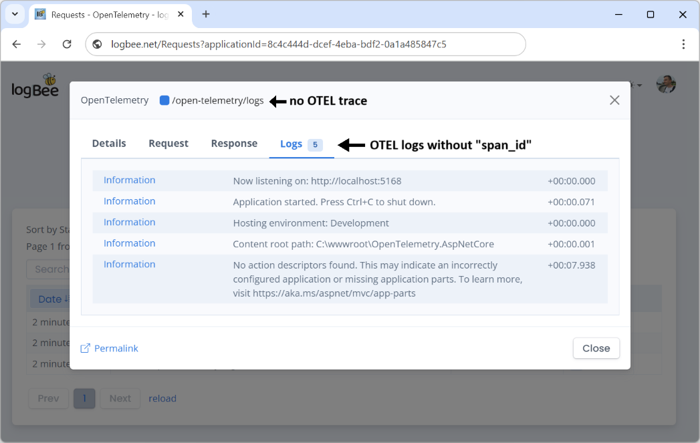
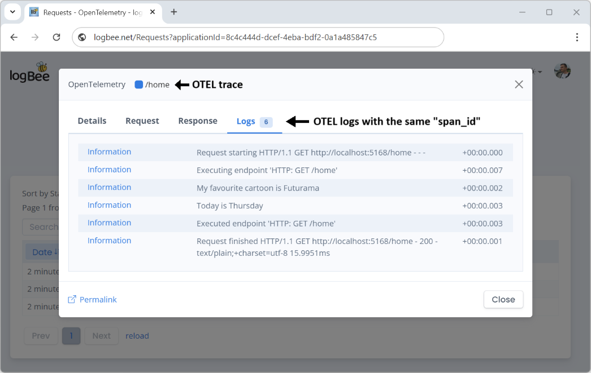

# OpenTelemetry

## Trace

Logbee saves the OpenTelemetry traces as individual requests, using the trace `span_id` as the unique identifier of each request.

## Logs

OpenTelemetry logs correlated with a trace (via the matching `span_id`), will be linked together with the corresponding trace (request) previously created in Logbee.

OpenTelemetry logs which are not correlated with a trace (logs `span_id` is empty), will be saved under a generic `/open-telemetry/logs` request.

Logs without an associated trace ("span_id") will be grouped in 5 minutes intervals.

